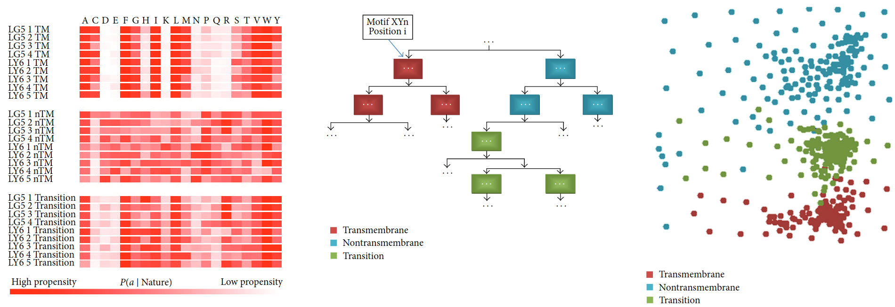

# Structure Topology Prediction of Discriminative Sequence Motifs in Membrane Proteins with Domains of Unknown Functions [[1]](#1)
## Motivation 
Membrane proteins play essential roles in cellular processes of organisms. Photosynthesis, transport of ions and small molecules, signal transduction, and light harvesting are examples of processes which are realised by membrane proteins and contribute to a cell’s specificity and functionality. The analysis of membrane proteins has shown to be an important part in the understanding of complex biological processes. Genome-wide investigations of membrane proteins have revealed a large number of short, distinct sequence motifs. Results. The in silico analysis of 32 membrane protein families with domains of unknown functions discussed in this study led to a novel approach which describes the separation of motifs by residue-specific distributions. Based on these distributions, the topology structure of the majority of motifs in hypothesised membrane proteins with unknown topology can be predicted. Conclusion. We hypothesise that short sequence motifs can be separated into structure-forming motifs on the one hand, as such motifs show high prediction accuracy in all investigated protein families. This points to their general importance in 𝛼-helical membrane protein structure formation and interaction mediation. On the other hand, motifs which show
high prediction accuracies only in certain families can be classified as functionally important and relevant for family-specific
functional characteristics. 

## Conclusion
In this work, 33 short sequence motifs reported in [[2]](#2) were investigated in 32 polytopic membrane protein families with domains of unknown functions. Transmembrane and nontransmembrane sequence regions were predicted using the TMHMM method [[3]](#3) and topology states were annotated to all detected sequence motif occurrences. These amino acid propensities were derived and employed to define log-odd profiles (LOP) of all variable sequence positions in the investigated motifs. Propensity tendencies according to the topology states were identified using UPGMA and XOM clustering. Both methods pointed to good separability and 
predictability of the topology state of a motif from its amino acid sequence. An information-based prediction algorithm was implemented and assessed using cross-validation and F-measure evaluation. Motifs showing high F-measures over all or only in certain investigated protein families were identified. From this insight, we postulate that short sequence motifs can be divided in general, structure-forming elements, which are present in numerous protein families and highly specific to their topology location. But they are probably less important for functional properties. Finally, motifs showing high F-measures only in certain membrane protein families may be important elements in establishing the individual properties which are necessary for the function of an entire protein family.
Also, the information of the spatial structure and the folding of proteins to be explored can be evaluated by affinities, because the spatial structure of proteins has been stronger conserved in evolution than the sequential composition of the folded protein chains. These are individual motifs or characteristic sequence parts which expose a certain biochemical function of proteins. Why does the nature pursue the principle of structure and function separation? Residues, which support a stable domain folding, are separated from those that induce a specific function. This procedure is a very efficient strategy of evolution. Two areas were simultaneously optimised [[4]](#4): 
* (i) the stability of the protein backbone in a given folding pattern, 
* (ii) the design of the amino acid sequence according to a specific function. 

 
Read more about this work <a href="https://downloads.hindawi.com/archive/2013/249234.pdf" target="_blank">here</a>.

## References
<a id="1">[1]</a>
Steffen Grunert, Florian Heinke, Dirk Labudde, "Structure Topology Prediction of Discriminative Sequence Motifs in Membrane Proteins with Domains of Unknown Functions", Structural Biology, vol. 2013, Article ID 249234, 10 pages, 2013. https://doi.org/10.1155/2013/249234

<a id="2">[1]</a>  Y. Liu, D. M. Engelman, and M. Gerstein, “Genomic analysis of membrane protein families: abundance and conserved motifs,” Genome Biology, vol. 3, no. 10, research0054, 2002

<a id="3">[2]</a> 
E. L. Sonnhammer, G. von Heijne, and A. Krogh, “A hidden markov model for predicting transmembrane helices in protein sequences,” Proceedings of the International Conference on Intelligent Systems for Molecular Biology, vol. 6, pp. 175–182, 1998.

<a id="4">[3]</a> 
B. Carl and T. John, Introduction to Protein Structure, Taylor and Francis, Auflage, 2nd edition, 1998.

